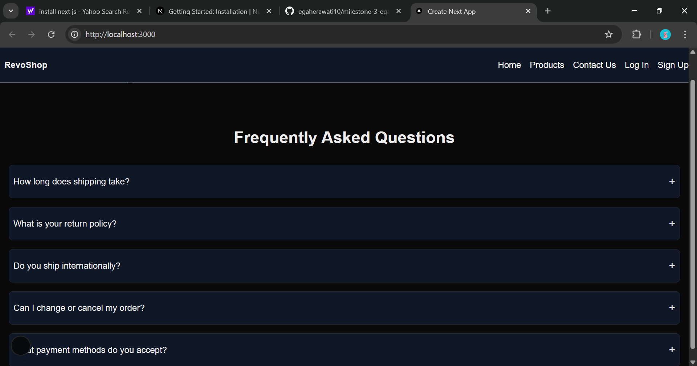
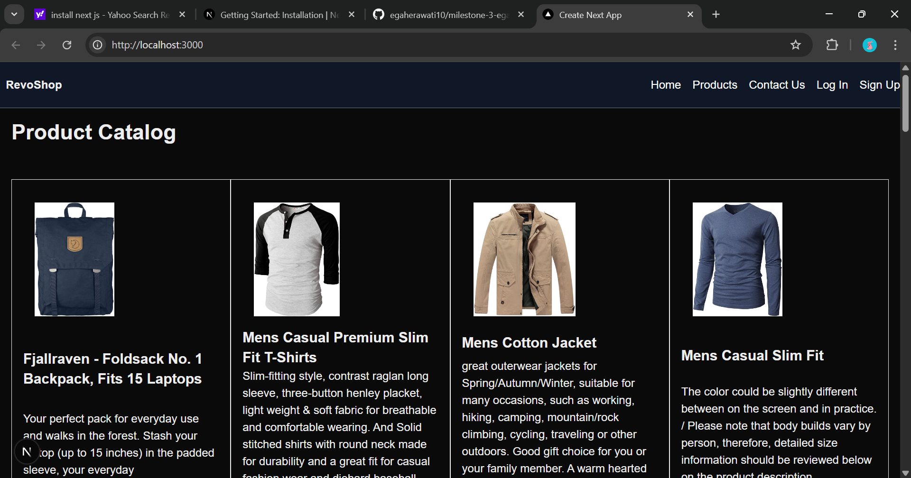
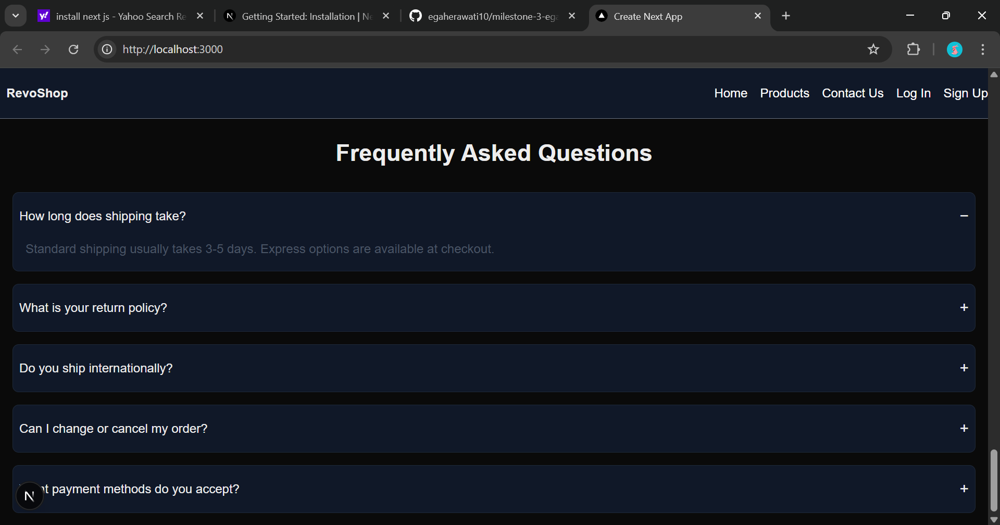

# Milestone 3 Project

## Overview

This is an overview of RevoShop shopping website. The features, tech stacks, and demo of this website is described down below.

## Features

* Navigation Bar : Allows visitors to move easily between sections
* Home Section : Shows visitors an overview about me
* Products Section : Shows visitors our available products
* COntact Us Section : Shows visitors about my projects
* Log In Section : Allows visitors to log in on existing account
* Sign Up Section : Allows new visitors to register their account

## Technologies Used

* Next Js from React
* Tailwind CSS for styling
* SSG for FAQ page
* SSR for products
* Dynamic routing between pages

## How to use

1. Clone this repository below to your local repository

> https://github.com/revou-fsse-feb25/milestone-3-egaherawati10.git

2. Install the latest version of Next Js in your terminal
> npx create-next-app@latest

3. Install npm in your terminal if you haven't
> npm install

4. Run dev
> npm run dev

## Deployed Website :

> Vercel : https://milestone-3-egaherawati10.vercel.app/

## Previews

Main page while load data

Product Catalog

FAQ Section

## Creator
Build with &#x2661; by Ega Herawati, 2025